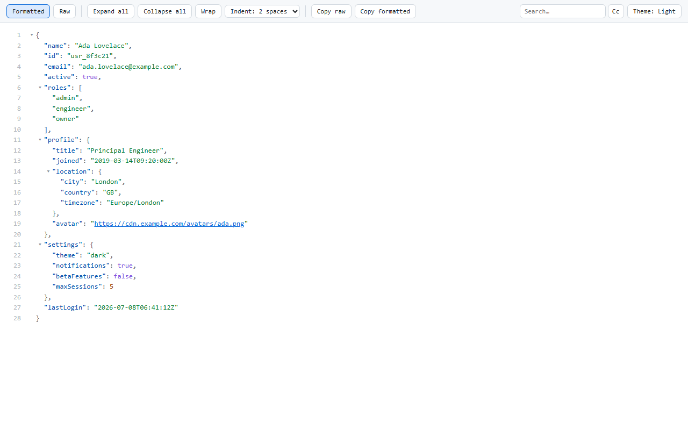
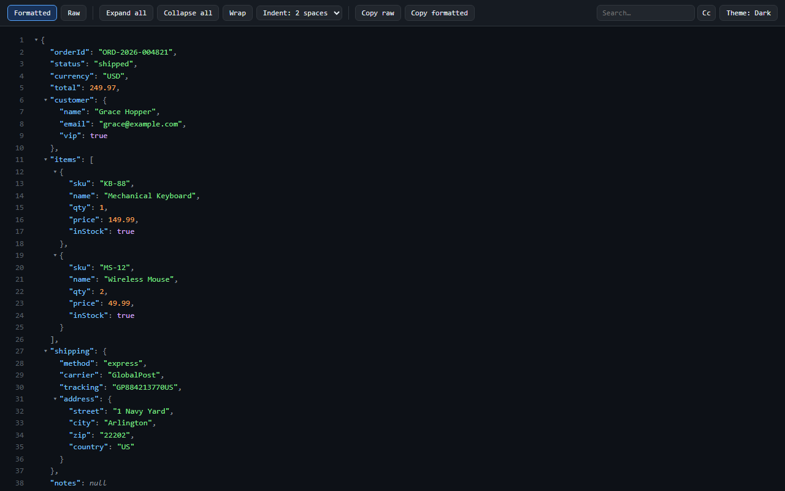
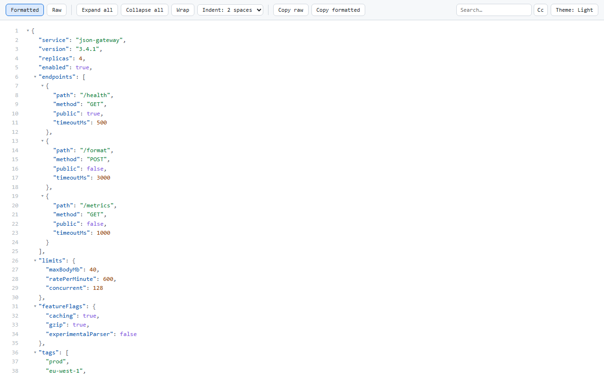
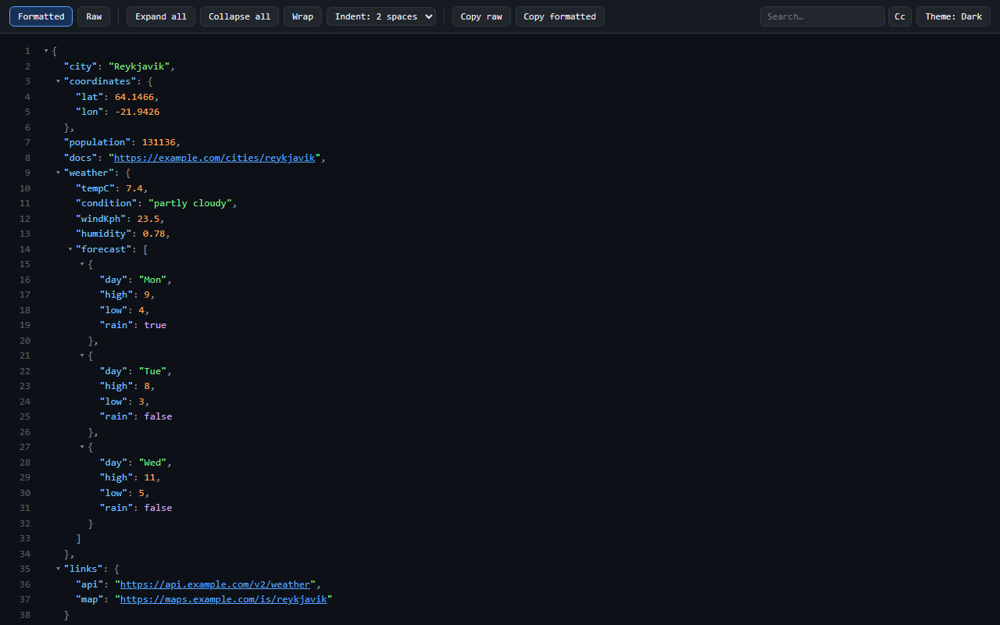
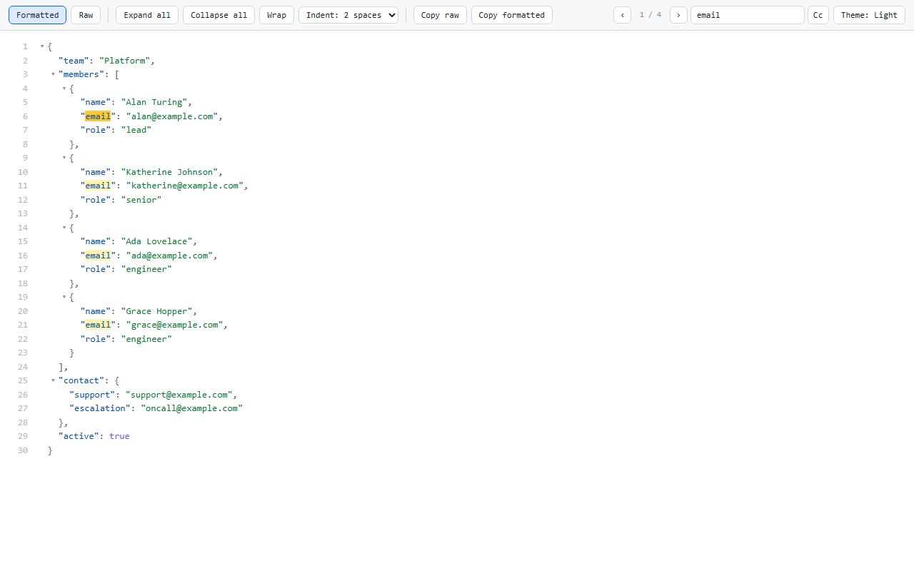

<p align="center">
  
</p>

# Free JSON Formatter

[](https://github.com/andret2344/free-json-formatter/actions/workflows/ci.yml)
[](https://codecov.io/gh/andret2344/free-json-formatter)
[](https://github.com/andret2344/free-json-formatter/releases/latest)
[](https://github.com/andret2344/free-json-formatter/commits)
[](src/manifest.json)
[](LICENSE)
[](package.json)
[](vitest.config.ts)
[](#install)
[](#install)
[](#install)

A fast, private JSON viewer for the browser. Open a JSON endpoint and the raw text becomes an
interactive, collapsible, syntax-highlighted tree - searchable, themeable, and ready to explore
before you have finished reading the first line.

It is built to be pleasant to use and easy to trust, in that order - and it manages both because
the two turn out to be the same engineering problem: **everything happens in your tab.** The
document is parsed locally, rendered locally, and stays there. There is no server to talk to and no
data to send, which is also why it is quick.

**What that means in practice**

- **It stays out of your way.** Big documents open at a sensible depth instead of dumping 20 000
  lines on you; branches render only when you open them; expanding a huge tree runs in batches you
  can cancel.
- **It is made for reading and digging.** Search runs over the parsed JSON, so it finds matches in
  branches that are still collapsed and opens exactly the one you asked for. Line numbers stay
  stable when you fold, the way code folding works. Any line's path is one click from your
  clipboard, ready to paste into devtools.
- **It is transparent by construction.** One API permission (`storage`, used only for your
  settings), plus site access required to detect JSON documents opened on any URL. No network
  requests, no telemetry, no remote code, and MIT-licensed source you can read in an afternoon.
  You do not have to take that on faith - the [Privacy Policy](PRIVACY.md) lists every key it
  writes, the end-to-end suite asserts that formatting a document makes no request at all, and the
  packed extension is under 30 kB.

---

## Table of contents

- [Why this exists](#why-this-exists)
- [Features](#features)
- [Screenshots](#screenshots)
- [Privacy](#privacy)
- [Install](#install)
- [Build from source](#build-from-source)
- [Development](#development)
- [How it works](#how-it-works)
- [Project layout](#project-layout)
- [Contributing](#contributing)
- [License](#license)

## Why this exists

In 2026 the most popular JSON viewer for Chrome - two million users, and a *Featured* badge - went
closed source, and the update it shipped began injecting a third-party script that put donation
prompts on retail checkout pages, scraped store identifiers, and resolved the user's location. Most
people found out from their antivirus, not from the changelog. The
[Hacker News thread](https://news.ycombinator.com/item?id=47721946) and the recent reviews on its
store listing tell the story.

The lesson was not "read the reviews more carefully". It was that a viewer for a JSON page has no
business being *able* to do any of that, and that the only privacy claim worth anything is one you
can check yourself. So this extension is built to be checkable:

- **Minimal access** - one API permission (`storage`) to remember your settings, plus site access
  required to detect JSON documents wherever they are opened. On non-JSON pages, the extension
  performs a lightweight check and exits.
- **No network code at all**, and an end-to-end test that fails if a request is ever made.
- **Nothing is injected** into any page that is not a JSON document - no ads, no affiliate code, no
  donation prompts, no remote script.
- **MIT, and small enough to read in an afternoon** - under 30 kB packed.
- [`PRIVACY.md`](PRIVACY.md) names every key it writes to your disk, and is updated in the same
  commit as any change to what is stored.

A feature-by-feature comparison with the other viewers is in [`docs/COMPARISON.md`](docs/COMPARISON.md).

## Features

- **Automatic detection** of raw JSON pages (an `application/json` response, a `.json` URL, or a
  page that is just a `<pre>` of valid JSON).
- **Collapsible tree** with lazy child rendering, so large documents stay responsive.
- **Indent guides** - a vertical line per nesting level, highlighted for the level under the pointer.
- **Syntax highlighting** for keys, strings, numbers, booleans, and `null`.
- **Clickable links** - URL string values become safe `target="_blank"` anchors.
- **Formatted / Raw** toggle - flip back to the original, untouched JSON text at any time.
- **Expand all / Collapse all**, plus **Ctrl/Cmd+click** on a node to fold or open its whole level at once.
- **Copy path** - hover any line and copy its path as a console-ready accessor chain (`json.items[0].id`),
  which pastes straight into devtools, where the extension already exposes the document as `json`.
- **Line links** - click a line number to put `#L21` in the address bar; opening that link reveals the
  line again, even when it sits in a branch nobody has expanded yet.
- **Line wrapping** toggle for long string values.
- **Configurable indentation** - 2/4/6/8 spaces or 1/2 tabs, applied live and remembered.
- **In-tree search** with match count, next/previous navigation, and a case-sensitivity toggle.
- **Copy** - copy the raw JSON, or the re-indented ("formatted") JSON, to the clipboard in one click.
- **Large-payload warning** in the toolbar when a document is big enough that rendering may feel slow.
- **Themes**: Auto (follows your OS), Light, and Dark - remembered across sessions.
- **Settings popup** for the maximum payload size (MB) and the depth the tree opens at. Changes save
  as you make them and apply to the next JSON page you open - the popup never reloads your tab, so
  nothing you have on screen is thrown away.

## Screenshots

| | |
|---|---|
|  |  |
|  |  |



## Privacy

Your JSON is yours. The extension reads the document that is already in your tab, formats it there,
and that is the end of the story:

| Guarantee             | Status                                                       |
|-----------------------|--------------------------------------------------------------|
| External requests     | **None** - the content script contacts no server.            |
| Telemetry / analytics | **None.**                                                    |
| Remote code           | **None** - everything ships in the bundle.                   |
| API permission        | **`storage`**, used only to remember preferences.            |
| Site access           | Used to detect and format JSON documents opened by the user. |

These are checkable claims, not promises: the [Privacy Policy](PRIVACY.md) names every setting the
extension stores on your device, [SECURITY.md](SECURITY.md) covers the security policy and how to
report an issue, and the source is right here.

## Install

**Chrome / Edge / Brave** - [Free JSON Formatter on the Chrome Web
Store](https://chromewebstore.google.com/detail/free-json-formatter/jhojiggmbjcjojkmebidpkhbfokgbgki).

Prefer to run the build yourself? Grab a packaged `.zip` from
[Releases](https://github.com/andret2344/free-json-formatter/releases), or build from source (below),
and load it unpacked:

**Chromium (Chrome, Edge, Brave, …)**

1. Download and unzip `free-json-formatter-chromium.zip`, or run `yarn build:chromium`.
2. Open `chrome://extensions` and enable **Developer mode**.
3. Click **Load unpacked** and select the `dist/chromium` folder.

**Firefox**

1. Download `free-json-formatter-firefox.zip`, or run `yarn build:firefox`.
2. Open `about:debugging#/runtime/this-firefox`.
3. Click **Load Temporary Add-on** and select `dist/firefox/manifest.json`.

Then open any JSON endpoint, or the bundled [`test/helpers/sample.json`](test/helpers/sample.json).

## Build from source

Requires Node.js LTS and [Yarn](https://classic.yarnpkg.com/) (Classic / v1).

```bash
git clone https://github.com/andret2344/free-json-formatter.git
cd free-json-formatter
yarn install

yarn build            # builds both dist/chromium and dist/firefox
yarn build:chromium   # Chromium only
yarn build:firefox    # Firefox only
```

## Development

```bash
yarn watch         # rebuild Chromium bundle on change
yarn typecheck     # tsc --noEmit
yarn test          # Vitest (jsdom)
yarn test:coverage # Vitest + v8 coverage report (CI uploads to Codecov)
yarn test:e2e      # Playwright against a real Chromium with the built extension loaded
yarn run check     # Biome format + lint check (CI runs this)
yarn check:fix     # Biome apply safe fixes
yarn format        # Biome format --write
```

> Use `yarn run check` (not `yarn check`) - bare `yarn check` is a Yarn Classic built-in, not this
> project's script.

The unit suite covers JSON detection, tree rendering, collapse/expand, expansion depth, search,
paths, the persisted settings, the content script (mounting, toolbar, themes, copying, line links),
the page-world console handle, and the settings popup. The end-to-end suite drives the packed
extension in a real browser - including the guarantees a unit test cannot make: that formatting a
document issues no network request at all, and that a search hit is painted through the CSS Custom
Highlight API rather than by mutating the tree.

## How it works

At `document_end` a content script inspects the page. The first check is deliberately cheap - an
ordinary HTML page is ruled out before anything is parsed, before storage is even read - so the
cost of having the extension installed on the rest of the web is a few microseconds per page.

When the document *is* JSON (served with a JSON content type, or a lone `<pre>` whose text parses),
it is parsed once and the tree is built off-screen, then swapped into the page in a single
synchronous step: you see raw text, then the finished viewer, with no flash of half-styled content
in between. Only the branches you open are ever rendered, which is what keeps a multi-megabyte
document responsive.

A second, tiny script runs in the page's own world so that devtools can see the parsed document as
`json` - the same handle the Copy path button writes paths against. Both scripts read; neither
fetches, uploads, or reports anything.

## Project layout

| Path                            | Purpose                                                   |
|---------------------------------|-----------------------------------------------------------|
| `src/manifest.json`             | Base MV3 manifest (Firefox id added at build).            |
| `src/content/content.ts`        | Entry point: detection, mounting, toolbar, line links.    |
| `src/content/content.css`       | All `fjf-*` styles + theming.                             |
| `src/content/console-handle.ts` | Page-world script: exposes the document to devtools.      |
| `src/viewer/formatter.ts`       | JSON → collapsible DOM tree (lazy children), expansion.   |
| `src/viewer/search.ts`          | Search over the parsed JSON + navigation and highlights.  |
| `src/viewer/expansion.ts`       | Picks the initial depth from the document's size + shape. |
| `src/viewer/dom.ts`             | Shared DOM element factories (createElement…).            |
| `src/shared/detect.ts`          | Decides whether a document is raw JSON.                   |
| `src/shared/config.ts`          | Persisted prefs: max size, depth, wrap, indent, case.     |
| `src/shared/types.ts`           | JSON value types and helpers.                             |
| `src/shared/bridge.ts`          | The contract between the isolated and page worlds.        |
| `src/popup/`                    | Settings popup (HTML, TypeScript, CSS).                   |
| `scripts/build.mjs`             | esbuild bundle + per-browser packaging.                   |
| `test/`                         | Vitest suites (jsdom).                                    |
| `e2e/`                          | Playwright suites (real Chromium, unpacked build).        |
| `.github/workflows/`            | CI: checks on push/PR, release on `v*` tags.              |

The extension icon is defined once in `assets/icon.svg` and rasterized to `icons/icon{16,48,128}.png`
with `yarn icons` (via [sharp](https://sharp.pixelplumbing.com/)). Edit the SVG and re-run to
regenerate.

## Contributing

Contributions are welcome! Please read [CONTRIBUTING.md](CONTRIBUTING.md) and the
[Code of Conduct](CODE_OF_CONDUCT.md). In short: keep it private (no telemetry/requests), brace
every `if`/loop, name your union types, run `yarn run check`, and add tests.

## License

[MIT](LICENSE) © andret2344
